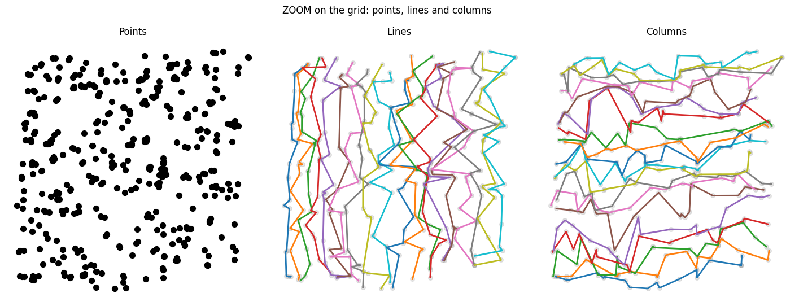

# Cartesian Grid Sort Algorithm

This repository illustrates the core cartesian grid sort procedure of the [`SquareNet`](https://github.com/ArmanddeCacqueray/SquareNet) ❒ gridification engine for demonstration purposes.

It showcases the live progress of the grid sorting algorithm 𝄜 and includes an [animated GIF](https://github.com/ArmanddeCacqueray/Cartesian-Grid-Sort/blob/main/cartesian_sort.gif) alongside the simple Python script used to generate it, as well as both the full python (slow, simple) and C++ implementation (optimized) of the cartesian grid sort.

---

## Usecase

The `Cartesian Grid Sort` allow to structure arbitrary point clouds as a multi-dimensional grid. The algorithm is quite simple once one get the main idea and could be reused in various contexts were a spatially coherent multi index structure can be usefull. Note that end user should rather refer to SquareNet gridfication package itself (see for exemple this [tutorial](https://colab.research.google.com/github/ArmanddeCacqueray/SquareNet/blob/main/00_getting_started.ipynb)), which simply require to 
```python
pip install squarenet
```

Regarding this auxiliar repository:
- Run `main.py` to reproduce the quick visual animated demo that showcase gridification in progress.
- Feel free to look at what's inside `sort.py` (not optimized, simple illustration purpose) to fully understand how the algorithm work.
- See `sort_core.cpp` for a C++ optimized version (multi-threaded).  
  It achieves **< 200 ms** on 1 million 2D points (tested on an old Ryzen 3 3250U). To reproduce the experiment:

**Windows (MSVC):**
```powershell
cl /O2 /openmp /EHsc /std:c++17 sort_core.cpp
.\sort_core.exe
```
**Linux/macOS:**
```Bash
g++ -O3 -fopenmp -std=c++17 sort_core.cpp -o sort_core
# or
clang++ -O3 -fopenmp -std=c++17 sort_core.cpp -o sort_core
./sort_core
```

## Algorithm (2D Version)

*Note: The generalization to higher dimensions is straightforward.*

**Initialization:**
Take $N$ random Euclidean points (in the main animation example, $N = 4225 = M^2 = 65 \times 65$ points). If N is not an even square, apply padding with dummy points that will fall in empty slots of the grid to complete $N$ to the nearest square $M^2$: 

$$ (x_k, y_k)_{1 \le k \le N} $$

Randomly split the flat key $k$ into a 2D multi-key to form a grid (purely random initialization): 

$$ k \leftrightarrow [i, j]_k $$
$$ (x_k, y_k)_{1 \le k \le N}\leftrightarrow (x_{ij}, y_{ij})_{1 \le i,j \le M} $$

**Iterative Sorting Procedure:**
1. Sort the $x$-coordinate along the row key $i$: update $[i, j]_k \leftarrow [i', j]_k$ where $i'$ ensures the $x_k$ coordinates are sorted along the $i$-axis (all columns $j$ are processed in parallel).
2. Sort the $y$-coordinate along the column key $j$: update $[i', j]_k \leftarrow [i', j']_k$.
3. Check if the $x$-sorting was broken by applying the $y$-sorting step (which is highly probable). If so, return to step 1 and repeat until both dimensions are simultaneously satisfied.

## Output

The algorithm produces a **bijective mapping** from the raw points `RP`, shape `[4225, 2]`: $(x_k, y_k)$ to a gridded tensor `GT`, shape `[65, 65, 2]`: $(x_{ij}, y_{ij})$. 

Upon termination, the resulting gridded view `GT` is guaranteed to be monotonic 📈 :
* $x$ strictly increases along $i$ ($\rightarrow$)
* $y$ strictly increases along $j$ ($\uparrow$)

This ensures that the multi-key $[i, j]$ is spatially coherent, meaning local neighborhoods are roughly preserved: the nearest spatial neighbors of a point with multi-key $[i, j]$ will likely have adjacent multi-keys $[i\pm1, j\pm1]$. Though a few outliers will unavoidably land at $[i\pm2, j\pm2]$ or further.

By construction, the transformation is a bijective assignement between the raw point key $k$ and the grid multi-key $[i, j]$. This allows for seamless data transfer between the flat point list and the grid using simple fancy indexing operations.

## Proof of Termination & link to Optimal Transport

A notable aspect of this algorithm is its proof of termination, which is relatively simple and establishes a link to Optimal Transport (thought the cartesian grid sort algorithm doesn't provide exact optimal transport but greedy and fast convergence to a good local minima).

Based on the classical [Rearrangement Inequality](https://en.wikipedia.org/wiki/Rearrangement_inequality), each sorting step strictly decreases the following global structural quantity (average transport energy) on the `GT`:

$$ \sum_{i,j} \left( (x_{ij} - i)^2 + (y_{ij} - j)^2 \right) $$

This provides a solid monovariant guaranteeing that no cycles will occur, and thus, that the algorithm will mathematically terminate. In practical—and even adversarial—cases, no more than 100 total iterations are typically required.

<p align="center">

</p>

---

## Take home

The idea of Cartesian grid sort is simple: loop over 1D Cartesian projections of the point cloud (x, y, z, ...) and sort points along the corresponding grid axis (rows, columns, ...). Each 1D sort is O(N log N) and fully vectorized. Since sorting along axis i+1 partially undoes the ordering along axis i, you repeat the full loop until all axes are sorted simultaneously — typically fewer than 50 iterations.

**What you get:**

- **Speed.** ⏱️ Millions of points in seconds. All operations are native tensor ops.
- **Coordinate monotonicity.** x increases along rows, y along columns, etc. This enable potential N-dimensional dychotomy principle for certain algorithms.
- **Approximate neighborhood preservation.** Points close in space land close in the grid. Concrete experimental results on a 1M-point 2D dataset (France map):
  - Requesting a 11×11 square window ([i-5:i+6, j-5:j+6] = 0.01% of candidates) → recovers ~97% of true nearest neighbors
  - Requesting a 31×31 square window ([i-15:i+16, j-15:j+16] = 0.1% of candidates) → recovers ~99.5%
- **Volume conservation (at macroscopic scale).** Bijectivity naturally leads to conservation of volumes (or more generally measures: $\int \rho(x)\, dV$ when density rho is not constant in the point cloud). By conservation of volume, it is **not** mean that $$\mathrm{vol}(g(A), g(B), g(C)) = \mathrm{vol}(A, B, C)$$ where $ABC$ is a triangle, since the image of a triangle is generally not a triangle anymore.
It would be equal to $$\mathrm{vol}(\Omega),\qquad \Omega = \{ g(X) \mid X \in ABC \}$$

**What you don't get:**

- **Optimal Transport.** Cartesian Grid Sort trades exactness for speed. If you need the provably optimal assignment, this isn't the right tool.
- **Reverse neighborhood preservation.** Close in space → close in grid, but *not* the other way around. Holes, clusters, and gaps in your data will be "closed" by the grid, which can place unrelated points next to each other.
- **Angular preservation.** Volume and angles can't both be conserved in the general case (classical result). Expect some distortion, especially near boundaries.
