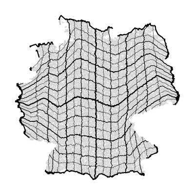

# Cartesian Grid Sort Algorithm

This repository illustrates the core cartesian grid sort procedure of the [`SquareNet`](https://github.com/ArmanddeCacqueray/SquareNet) ❒ gridification engine for demonstration purposes.

It showcases the live progress of the grid sorting algorithm 𝄜 and includes an [animated GIF](https://github.com/ArmanddeCacqueray/Cartesian-Grid-Sort/blob/main/cartesian_sort.gif) alongside the simple Python script used to generate it, as well as both the full python (slow, simple) and C++ implementation (optimized) of the cartesian grid sort.

<p align="center">

</p>

---

## Quick Start

The `Cartesian Grid Sort` allows to structure arbitrary point clouds as a multi-dimensional grid. The algorithm is quite simple once one gets the main idea and could be reused in various contexts where a spatially coherent multi index structure can be useful. Note that end users should rather refer to SquareNet gridfication package itself (see for example this [tutorial](https://github.com/ArmanddeCacqueray/SquareNet/blob/main/00_getting_started.ipynb), or this [benchmark](https://github.com/ArmanddeCacqueray/SquareNet/blob/main/benchmark/squarenet_benchmark_kdtree.ipynb) with kd-tree) which simply requires to 
```python
pip install squarenet
```

Regarding this auxiliary repository:
- Run `main.py` to reproduce the quick visual animated demo that showcases gridification in progress.
- Feel free to look at what's inside `sort.py` (not optimized, for illustration purposes) to fully understand how the algorithm works.
- See `sort_core.cpp` for a C++ optimized version (multi-threaded).  
  It achieves **< 200 ms** on 1 million 2D points (tested on an old Ryzen 3 3250U). To reproduce the experiment:

**Windows (MSVC):**
```powershell
cl /O2 /openmp /EHsc /std:c++17 sort_core.cpp
.\sort_core.exe
```
**Linux/macOS:**
```Bash
g++ -O3 -fopenmp -std=c++17 sort_core.cpp -o sort_core
# or
clang++ -O3 -fopenmp -std=c++17 sort_core.cpp -o sort_core
./sort_core
```

## Algorithm (2D Version)

*Note: The generalization to higher dimensions is straightforward.*

**Initialization:**
Take the  $N$ arbitrary Euclidean points to be processed:

$$ (x_k, y_k)_{1 \le k \le N} $$

In the main animation example, $N = 4225 = M^2 = 65 \times 65$ points. If N is not a perfect square, pad with dummy $\pm \infty$ points that will fall in empty slots of the grid to complete $N$ to the nearest square:

$$ N \leftarrow M^2 $$ 

Randomly assign the flat key $k$ to a 2D multi-key to form a grid (purely random initialization): 

$$ k \leftrightarrow [i, j]_k \quad i,j \in 1,2,3,..., M $$

$$ (x_k, y_k) \leftrightarrow (x_{ij}, y_{ij}) $$

**Iterative Sorting Procedure:**
1. Sort the Points according to their $x$-coordinate along the row key $i$: update $[i, j] \leftarrow [i', j]$ where $i'$ ensures the $x_{ij}$ coordinates are sorted along the $i$-axis (all columns $j$ are processed in parallel).
2. Sort the Points according to their $y$-coordinate along the column key $j$: update $[i, j] \leftarrow [i, j']$ to ensure monotonic y-coordinates.
3. Check if the $x$-sorting was broken by applying the $y$-sorting step (which is highly probable). If so, return to step 1 and repeat until both dimensions are simultaneously satisfied.

## Output

The algorithm produces a **bijective mapping** from the raw points `RP`, shape `[4225, 2]`: $(x_k, y_k)$ to a gridded tensor `GT`, shape `[65, 65, 2]`: $(x_{ij}, y_{ij})$. 

Upon termination, the resulting gridded view `GT` is guaranteed to be monotonic 📈 :
* $x$ strictly increases along $i$ ($\rightarrow$)
* $y$ strictly increases along $j$ ($\uparrow$)

This ensures that the multi-key $[i, j]$ is spatially coherent, meaning local neighborhoods are roughly preserved: the nearest spatial neighbors of a point with multi-key $[i, j]$ will likely have adjacent multi-keys $[i\pm1, j\pm1]$. Though a few outliers will unavoidably land at $[i\pm2, j\pm2]$ or further.

By construction, the transformation is a bijective assignment between the raw point key $k$ and the grid multi-key $[i, j]$. This allows for seamless data transfer between the flat point list and the grid using simple fancy indexing operations.

## Proof of Termination & link to Optimal Transport

A notable aspect of the `Cartesian Grid Sort` algorithm is its proof of termination, which is relatively simple and establishes a link to Optimal Transport (though the cartesian grid sort algorithm doesn't provide exact optimal transport but greedy and fast convergence to a good local minimum).

Based on the classical [Rearrangement Inequality](https://en.wikipedia.org/wiki/Rearrangement_inequality), each sorting step strictly decreases the following global structural quantity (average transport energy) on `GT`:

$$ \sum_{i,j} \left( (x_{ij} - i)^2 + (y_{ij} - j)^2 \right) $$

This provides a solid monovariant guaranteeing that no cycles will occur, and thus, that the algorithm will mathematically terminate. In practical—and even adversarial—cases, no more than 100 total iterations are typically required.

<p align="center">

</p>

## Grid versus tree & link to KDTree

There is an interesting parallel to draw between the data structure that `Cartesian Grid Sort` produces (a spatially coherent, monotonic multi index) and standard `KDTree` data structure. In fact, in cases where N is an exact power of 2, the Kd-tree recursive  partitioning path of each point of the cloud (left-down-left-up-right-up...) can directly be converted to a [i, j] multi-index, and it turns out that the corresponding grid $(x_{ij}, y_{ij})$ will already be sorted (x coordinate increasing along i and y coordinate along j) by construction of the tree. Notably, the construction of the kdtree and the cartesian sort grid have essentially the same runtime (see benchmark mentioned in Quick Start section).

The main difference between KDTree and Cartesian Grid Sort is the paradigm. KDTree is coarse to fine and threshold based (left/right, up/down)  while Cartesian Grid Sort is purely linear (i/i+1, j/j+1), with row / column axes progressively following the local structure of the point cloud without strong discontinuities. What will really make a difference is the context where the data structure is used: if e.g. one is interested for the neighbors of a single target, KDTree is probably the best choice. If one need the neighbors of all the points, e.g. to apply a Convolution Neural Network on a geometric dataset, Cartesian Grid Sort offers a simple interface between efficient tensor based frameworks and unstructured point clouds.

---

## Take home

The idea of `Cartesian grid sort` is simple: loop over 1D Cartesian projections of the point cloud (x, y, z, ...) and sort points along the corresponding grid axis (rows, columns, etc). Each 1D sort is O(N log N). Since sorting along one axis partially undoes the ordering along previous axes, you repeat the full sorting loop until all axes are sorted simultaneously — typically fewer than 50 iterations.

**What you don't get:**

- **Optimal Transport.** `Cartesian Grid Sort` trades exactness for speed. If you need the provably optimal assignment, this isn't the right tool.
- **Reverse neighborhood.** Close in space → close in grid, but *not* the other way around. Holes, clusters, and gaps in your data will be "closed" by the grid, which can place unrelated points next to each other.
- **Angular preservation.** Volume and angles can't both be conserved in the general case by a mapping (classical result). Expect some angular distortion, especially near boundaries.

**What you get:**

- **Speed.** ⏱️ Millions of points in seconds. All operations are native tensor ops.
- **Coordinate monotonicity.** x increases along rows, y along columns, etc. This enables e.g. the generalised searchsorted query tool of `SquareNet` for approximate k-NN.
- **Neighborhood preservation.** Points close in space land close in the grid. Concrete experimental results on a 1M-point 2D dataset (France map distribution):
  - Requesting a 11×11 square window  arround a query point [i,j]: [i-5:i+6, j-5:j+6] = 0.01% of candidates → recovers ~97% of the physical nearest neighbors
  - Requesting a 31×31 square window ([i-15:i+16, j-15:j+16] = 0.1% of candidates) → recovers ~99.5%
